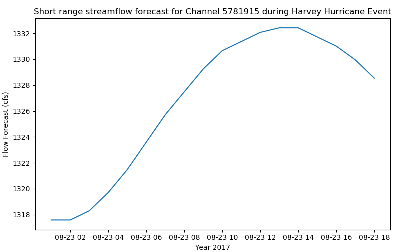

# nwm
[](https://nwm.readthedocs.io/en/latest/?badge=latest)
[](https://github.com/gantian127/nwm/blob/master/LICENSE.txt)
[](https://mybinder.org/v2/gh/gantian127/nwm/master?filepath=notebooks%2Fnwm.ipynb)


Python library to fetch and process the National Water Model (NWM) NetCDF datasets. 

## Get Started


#### Install package

```
$ pip install nwm
```

#### Download NWM Data
You can launch binder to test and run the code below.

##### Example 1: use NwmHs class to download data (Recommended method)

```python
import matplotlib.pyplot as plt

from nwm import NwmHs

# get data from National water model HydroShare App
dataset = NwmHs().get_data(archive='harvey', config='short_range', geom='channel_rt',
                           variable='streamflow', comid=[5781915], init_time=0, 
                           start_date='2017-08-23')

# show metadata
dataset.attrs

# plot data
dataset.plot()
plt.xlabel('Year 2017')
plt.ylabel('{} ({})'.format(dataset.variable_name,dataset.variable_unit))
plt.title('Short range streamflow forecast for Channel 5781915 during Harvey Hurricane Event')
```


##### Example 2: use BmiNwmHs class to download data (Demonstration of how to use BMI)

```python
import matplotlib.pyplot as plt
import numpy as np
import cftime

from nwm import BmiNwmHs


# initiate a data component
data_comp = BmiNwmHs()
data_comp.initialize('config_file.yaml')

# get variable info
var_name = data_comp.get_output_var_names()[0]
var_unit = data_comp.get_var_units(var_name)

# get time info
start_time = data_comp.get_start_time()
end_time = data_comp.get_end_time()
time_step = data_comp.get_time_step()
time_unit = data_comp.get_time_units()
time_steps = int((end_time - start_time)/time_step) + 1

# initiate numpy arrays to store data
stream_value = np.empty(1)
cftime_array = np.empty(time_steps)
stream_array = np.empty(time_steps)

for i in range(0, time_steps):
    data_comp.get_value(var_name, stream_value)
    stream_array[i] = stream_value
    cftime_array[i] = data_comp.get_current_time()
    data_comp.update()

time_array = cftime.num2date(cftime_array, time_unit, only_use_cftime_datetimes=False, only_use_python_datetimes=True)

# plot data
plt.plot(time_array, stream_array)
plt.xlabel('Year 2017')
plt.ylabel('{} ({})'.format(var_name, var_unit))
plt.title('Short range streamflow forecast for Channel 5781915 during Harvey Hurricane Event')
```

